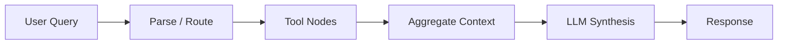

# League Multi-Tool LLM Agent


A graph-based, tool-augmented LLM assistant for **League of Legends** that aims to support player analysis, champion recommendations, builds, counters, and coaching workflows.

---

## Current Focus

This repository is currently focused on setting up the project foundation:

- Pydantic AI graph-based orchestration
- PostgreSQL / pgvector-backed retrieval
- Ollama-powered local model workflow
- Devcontainer-based reproducible development environment
- Gradio-ready interface path

---

## Architecture Preview



## Dev Environment

This project currently includes:

- a Docker/devcontainer workflow
- uv for dependency management
- local Ollama initialization for model serving
- Python 3.12 project configuration


## Quick Start
```bash
uv sync
```

If using the devcontainer, the environment setup is handled automatically during container creation.

## Planned Capabilities

- Player profile and match-history analysis
- Champion recommendation workflows
- Build and counter retrieval
- Patch/meta-aware responses
- Retrieval-augmented generation with structured + semantic sources