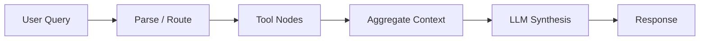

# League Multi-Tool LLM Agent


A graph-based, tool-augmented LLM assistant for **League of Legends** that aims to support player analysis, champion recommendations, builds, counters, and coaching workflows.

---

## Current Focus

This repository is currently focused on setting up the project foundation:

- Pydantic AI graph-based orchestration
- PostgreSQL / pgvector-backed retrieval
- Ollama-powered local model workflow
- Devcontainer-based reproducible development environment
- Gradio-ready interface path

---

## Architecture Preview


```mermaid
flowchart LR
    U[User Query] --> P[Parse / Route]
    P --> T[Tool Nodes]
    T --> A[Aggregate Context]
    A --> L[LLM Synthesis]
    L --> R[Response]
```

## Dev Environment

This project currently includes:

- a Docker/devcontainer workflow
- uv for dependency management
- local Ollama initialization for model serving
- Python 3.12 project configuration

## Running the Project Google Colab (useful for grading this project)

Using/running the VA (use your `SJSU email` to access)
- https://colab.research.google.com/drive/12Dj_u7tUs_gODADFkjEwPKvwgImWwEq8?usp=sharing

Run Evaluation pipeline (use your `SJSU email` to access)
- https://colab.research.google.com/drive/1egaRXGsfhlacrs5td7TbRf6e7mVbsDpr?usp=sharing

## Running the Project Locally

### Recommended Setup

The recommended way to run this project locally is with **Docker** and **VS Code Dev Containers**. This avoids manually installing system dependencies, Python packages, PostgreSQL/pgvector, and Ollama-related tooling.

This project uses:

- Python 3.12
- uv for dependency management
- PostgreSQL with pgvector
- Ollama for local model serving
- GPU support through Docker/NVIDIA when available

The Dev Container is configured to use the `app` service and open the workspace at `/home/dev/src`. It also runs `.devcontainer/postCreate.sh` after the container is created.

---

## Option 1: VS Code Dev Containers (Recommended)

### Prerequisites

Install:

- Docker / Docker Desktop
- VS Code
- VS Code Dev Containers extension
- VS Code Docker extension

For GPU support, also install:

- NVIDIA GPU drivers
- NVIDIA Container Toolkit

### Steps

```bash
git clone <repository-url>
cd <project-root>
code .
```

In VS Code:

1. Open the Command Palette.
2. Select: Dev Containers: Reopen in Container

VS Code will build and attach to the development container automatically.

The container stack includes:

app
postgres
ollama

PostgreSQL is available on port 5432, and Ollama is available on port 11434.

## Option 2: Manual Docker Compose Setup

You can also start the development stack manually:

`docker compose -f .devcontainer/docker-compose.dev.yml up --build -d`

Then attach to the app container:

`docker exec -it league-multi-tool-llm-agent-dev-app-1 bash`

If the container name differs, check running containers with:

`docker ps`

Once inside the container, install dependencies **if needed**:

`uv sync --frozen`

## Ollama

Ollama runs inside the Docker Compose network and exposes:

`http://localhost:11434`

Models are cached in the ollama-models Docker volume so they do not need to be downloaded again after every rebuild.

## Stopping the Environment

Stop the containers:

`docker compose -f .devcontainer/docker-compose.dev.yml down`

Stop containers and remove volumes:

`docker compose -f .devcontainer/docker-compose.dev.yml down -v`

## Planned Capabilities

- Player profile and match-history analysis
- Champion recommendation workflows
- Build and counter retrieval
- Patch/meta-aware responses
- Retrieval-augmented generation with structured + semantic sources